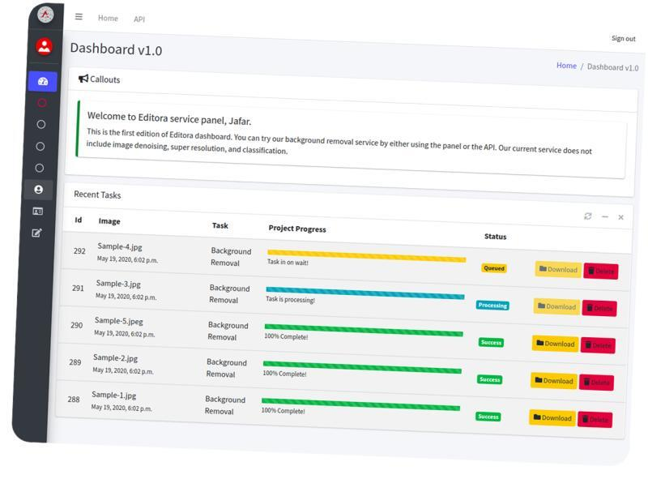
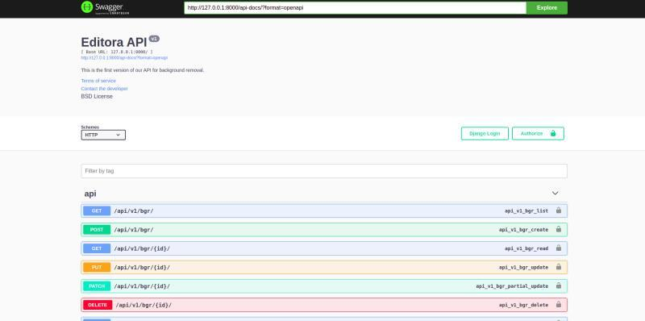

<p align="center">
  
  
  
  <br><em>Homepage · Admin Dashboard · API Documentation</em>
</p>

# 🖼️ EditoraAI – Intelligent Image Processing Platform

**EditoraAI** is a lightweight, scalable platform built to offer intelligent image-processing services through a modern REST API. Designed for editorial and content-heavy workflows, the system delivers fast, reliable backend services with a user-friendly dashboard and fully documented APIs.

---

## 🚀 Features

- 📷 **Image Processing API**  
  Custom RESTful endpoints for advanced image handling using Django REST Framework (DRF)

- ⚙️ **Backend Optimization**
  - Task queueing with **Celery**
  - Asynchronous job handling with **Redis**
  - Smart caching via **Varnish**

- 🧪 **Interactive API Docs**
  - Full API documentation using **Swagger (drf-yasg)**

- 🖥️ **Admin & Service Dashboard**
  - Custom panel to monitor services and manage jobs
  - Frontend developed with responsive templates

- 📡 **Production Deployment**
  - Nginx + Gunicorn for performance and scale
  - Process control with Supervisor

---

## 🛠️ Tech Stack

- **Backend**: Django + DRF
- **Asynchronous Tasks**: Celery + Redis
- **Frontend**: HTML/CSS (custom service panels)
- **API Documentation**: Swagger via `drf-yasg`
- **Caching**: Varnish
- **Deployment**: Nginx, Gunicorn, Supervisor (Ubuntu)

---

## 📁 Project Structure (Simplified)

```plaintext
editora-ai/
├── api/            # DRF views, serializers, and endpoints
├── dashboard/      # Admin panel views and templates
├── docs/           # Swagger integration and schema settings
├── media/          # Uploaded/generated image files
├── static/         # Frontend assets
├── templates/      # Frontend templates for homepage & panel
├── editora/        # Django project config (settings, wsgi, etc.)
├── celery.py       # Celery integration entrypoint
├── urls.py         # Main URL routes
├── requirements.txt
└── manage.py
